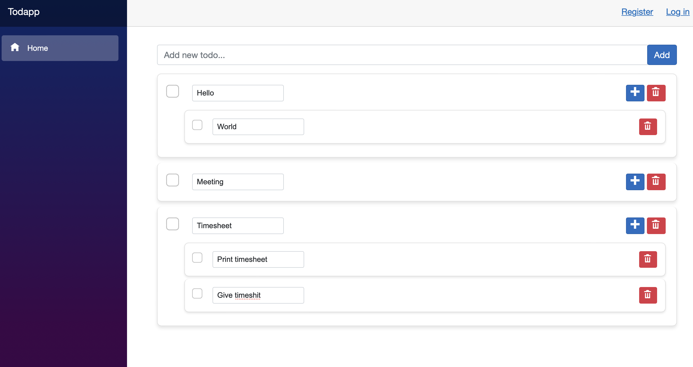

# Todapp
👋 **Salut l'équipe SysNet**,

On commence un nouveau projet ! Celui-ci sera un peu différent, car nous allons construire par-dessus jusqu'à atteindre l'application Blazor Server suivante :



C'est pourquoi, pour vous éviter des erreurs, je vous conseille de suivre les mêmes conventions de nommage que moi.

Ce projet sera un peu plus complexe que d'habitude. Lisez jusqu'au bout et suivez le parcours donné sans précipitation.

# 🎯 Première étape : Todapp en mode Console

Notre objectif initial est de mettre en place une version console de Todapp. Cette étape est cruciale et servira de fondation solide pour les fonctionnalités à venir. Vous interagirez avec l'application via des commandes telles que 'add', 'list', 'delete'... Voici un exemple de ce à quoi vous pouvez vous attendre :

```csharp
daniel@mac:~/Todapp/Todapp > dotnet run
Welcom to Todapp !

Available Commands: 'add', 'list', 'add-subtask', 'delete', 'exit'
Enter command: list
Todo Items:
- Todoitem ID: 58
- Description: Hello
- Completed: No
- SubTasks:
        - Todoitem ID: 60
        - Description: World
        - Completed: No
        - Parent todoitem ID: 58

-------------
- Todoitem ID: 61
- Description: Meeting
- Completed: No

-------------
- Todoitem ID: 62
- Description: Timesheet
- Completed: No
- SubTasks:
        - Todoitem ID: 63
        - Description: Print timesheet
        - Completed: No
        - Parent todoitem ID: 62
        - Todoitem ID: 64
        - Description: Give timeshit
        - Completed: No
        - Parent todoitem ID: 62

```
## 🌟 Ce Que Vous Allez Accomplir

Voici un aperçu des étapes clés et des compétences que vous allez développer au cours de ce projet :

### 1. **Établir une Architecture Solide**

   - Vous allez mettre en place un projet multi-couches avec des bibliothèques de classes (`DataLibrary`, `SharedLibrary`) et une application console (`Todapp`).
   - Vous configurerez les dépendances et les packages nécessaires, jetant les bases pour un développement efficace et structuré.

### 2. **Définir un Modèle de Données Cohérent**

   - Vous créerez des modèles d'entités (`TodoItem`, `User`) qui serviront de fondement à votre système de gestion de tâches.

### 3. **Implémenter le Repository Pattern**

   - Vous développerez une interface `IRepository` et des repositories concrets comme `TodoItemDapperRepository` et `UserADORepository`.
   - Ces repositories fourniront une couche d'abstraction essentielle pour vos opérations de base de données.

### 4. **Concevoir des Services pour la Logique Métier**

   - Vous mettrez en place des services (`TodoItemService`, `UserService`) qui encapsuleront la logique métier complexe, simplifiant les interactions avec les repositories.

### 5. **Adopter l'Injection de Dépendance**

   - Vous intégrerez l'Injection de Dépendance en utilisant `Microsoft.Extensions.DependencyInjection`, ce qui améliorera la flexibilité et la testabilité de votre application.

### 6. **Mettre en Œuvre le Pattern Command**

   - Vous concevrez une interface `ICommand` et développerez des commandes spécifiques pour gérer les interactions utilisateur de manière élégante et organisée.
   - Un `CommandExecutor` sera utilisé pour exécuter les commandes selon les entrées de l'utilisateur.

### 7. **Créer une Interface Utilisateur Interactive**

   - Vous élaborerez une boucle principale dans votre application console pour traiter efficacement les commandes de l'utilisateur, rendant l'interaction avec l'application intuitive et réactive.

## 🏗️ Mise en Place

Avant de plonger dans le vif du sujet, préparons notre environnement de travail. Suivez ces étapes pour installer et configurer les composants nécessaires :

⚠️ **Attention : Ces commandes doivent être executées depuis le même répertoire** ⚠️
1. **Création de la bibliothèque de classes "DataLibrary"**
   Lancez cette commande pour créer notre première bibliothèque de classes. Elle va nous servir pour gérer nos données.
   ```bash
   dotnet new classlib -n DataLibrary
   ```

2. **Création de la bibliothèque de classes "SharedLibrary"**
   La même chose pour notre seconde bibliothèque. Celle-ci, on va l'utiliser pour partager du code entre les différents projets.
   ```bash
   dotnet new classlib -n SharedLibrary
   ```

3. **Création de l'application console "Todapp"**
   Maintenant, passons à notre application principale. C'est une application console nommée "Todapp".
   ```bash
   dotnet new console -n Todapp
   ```

Super, maintenant que tout est en place, on va lier tout ça :

4. **Ajout de référence de "Todapp" à "DataLibrary"**
   Avec cette commande, notre appli "Todapp" saura qu'elle peut utiliser "DataLibrary".
   ```bash
   dotnet add Todapp/Todapp.csproj reference DataLibrary/DataLibrary.csproj
   ```

5. **Ajout de référence de "Todapp" à "SharedLibrary"**
   De même, on fait savoir à "Todapp" qu'elle peut accéder à "SharedLibrary".
   ```bash
   dotnet add Todapp/Todapp.csproj reference SharedLibrary/SharedLibrary.csproj
   ```

6. **Ajout de référence de "DataLibrary" à "SharedLibrary"**
   Finalement, on fait en sorte que "DataLibrary" utilise aussi "SharedLibrary".
   ```bash
   dotnet add DataLibrary/DataLibrary.csproj reference SharedLibrary/SharedLibrary.csproj
   ```
📌 Astuce : Vous pouvez retirer les fichiers Class1.cs générés par défaut dans les bibliothèques pour plus de clarté.
## 📦 Les Packages

Voici comment ajouter les packages nécessaires à chaque projet :

   1. Projet "Todapp"

      ```bash
      # Pour la manipulation de la base de données
      dotnet add Todapp/Todapp.csproj package Dapper

      # Pour les diagnostics
      dotnet add Todapp/Todapp.csproj package Microsoft.AspNetCore.Diagnostics.EntityFrameworkCore

      # Pour la gestion de l'identité
      dotnet add Todapp/Todapp.csproj package Microsoft.AspNetCore.Identity.EntityFrameworkCore

      # Pour l'interface utilisateur de l'authentification
      dotnet add Todapp/Todapp.csproj package Microsoft.AspNetCore.Identity.UI

      # Pour la base de données SQL Server
      dotnet add Todapp/Todapp.csproj package Microsoft.EntityFrameworkCore.SqlServer

      # Pour les outils Entity Framework Core
      dotnet add Todapp/Todapp.csproj package Microsoft.EntityFrameworkCore.Tools

      # Pour la gestion des dépendances
      dotnet add Todapp/Todapp.csproj package Microsoft.Extensions.DependencyInjection
      ```

2. Projet "SharedLibrary"

   ```bash
   # Pour l'accès aux données
   dotnet add SharedLibrary/SharedLibrary.csproj package Microsoft.EntityFrameworkCore

   # Pour la sérialisation des expressions LINQ
   dotnet add SharedLibrary/SharedLibrary.csproj package Serialize.Linq
   ```

3. Projet "DataLibrary"

   ```bash
   # Pour l'accès aux données
   dotnet add DataLibrary/DataLibrary.csproj package Microsoft.EntityFrameworkCore

   # Pour la gestion de la configuration
   dotnet add DataLibrary/DataLibrary.csproj package Microsoft.Extensions.Configuration

   # Pour la sérialisation des expressions LINQ
   dotnet add DataLibrary/DataLibrary.csproj package Serialize.Linq

   # Pour la manipulation de la base de données
   dotnet add DataLibrary/DataLibrary.csproj package Dapper

   # Pour les diagnostics
   dotnet add DataLibrary/DataLibrary.csproj package Microsoft.AspNetCore.Diagnostics.EntityFrameworkCore

   # Pour la gestion de l'identité
   dotnet add DataLibrary/DataLibrary.csproj package Microsoft.AspNetCore.Identity.EntityFrameworkCore

   # Pour l'interface utilisateur de l'authentification
   dotnet add DataLibrary/DataLibrary.csproj package Microsoft.AspNetCore.Identity.UI

   # Pour la base de données SQL Server
   dotnet add DataLibrary/DataLibrary.csproj package Microsoft.EntityFrameworkCore.SqlServer

   # Pour les outils Entity Framework Core
   dotnet add DataLibrary/DataLibrary.csproj package Microsoft.EntityFrameworkCore.Tools
   ```

Après avoir ajouté tous les packages nécessaires, vous pouvez lancer votre application Todapp en exécutant la commande suivante :

```bash
dotnet run --project Todapp/Todapp.csproj
```
#### 🎉 Si vous voyez s'afficher "Hello, World !", notre configuration initiale est réussie et nous sommes prêts pour la suite !

## 📦 Les Settings

Pour configurer notre application, nous allons utiliser un fichier de configuration `appsettings.json`. Voici comment mettre en place la configuration dans votre application :

```csharp
// Importez la bibliothèque de configuration
using Microsoft.Extensions.Configuration;

Console.WriteLine("👋 Bienvenue dans Todapp !");

// Créez une configuration à partir du fichier appsettings.json
IConfiguration configuration = new ConfigurationBuilder()
    .SetBasePath(Directory.GetCurrentDirectory())
    .AddJsonFile("appsettings.json", optional: false, reloadOnChange: true)
    .Build();

// Obtenez la chaîne de connexion à partir de la configuration
var connectionString = configuration.GetConnectionString("DefaultConnection");
```

📌 N'oubliez pas de personnaliser appsettings.json avec vos propres paramètres de connexion.

 Voici à quoi cela devrait ressembler dans votre fichier `appsettings.json` :

```json
{
    "ConnectionStrings": {
        "DefaultConnection": "Server=webdev03.office.syslog.ch\\sqldev2019;User Id=sa;Password=commeDabb;Database=TodappDB;TrustServerCertificate=true;Encrypt=false;"
    }
}
```

Pour ajouter le fichier `appsettings.json`, vous pouvez utiliser la commande suivante:

```bash
touch Todapp/appsettings.json
```

# 🚀 Développement de l'Application

## Modèles d'entités

Maintenant que notre environnement de développement est prêt, il est temps de structurer nos modèles d'entités. Ces modèles seront la base de notre système de gestion de tâches dans l'application Todapp.

### 🗂️ Création du Dossier Models

Dans le projet "SharedLibrary", créez un dossier nommé Models.

```bash
mkdir SharedLibrary/Models
```
Ajoutez ensuite les classes ``TodoItem`` et ``User`` dans ce dossier.
```c#
using System.ComponentModel.DataAnnotations;
using System.ComponentModel.DataAnnotations.Schema;
using System.Text;

namespace SharedLibrary.Models
{
    /// <summary>
    /// Represents a to-do item with potential subtasks.
    /// </summary>
    public class TodoItem
    {
        /// <summary>
        /// Gets or sets the unique identifier for the to-do item.
        /// </summary>
        [Key]
        public int TodoItemId { get; set; }

        /// <summary>
        /// Gets or sets the identifier of the user associated with the to-do item.
        /// </summary>
        public int UserId { get; set; }

        /// <summary>
        /// Gets or sets the identifier of the parent to-do item, if any.
        /// </summary>
        public int? ParentTodoItemId { get; set; }

        /// <summary>
        /// Gets or sets the description of the to-do item.
        /// </summary>
        /// <remarks>
        /// The description is required and has a maximum length of 200 characters.
        /// </remarks>
        [Required]
        [MaxLength(200)]
        public string Description { get; set; } = string.Empty;

        /// <summary>
        /// Gets or sets a value indicating whether the to-do item is completed.
        /// </summary>
        public bool IsCompleted { get; set; }

        /// <summary>
        /// Gets or sets the user associated with the to-do item.
        /// </summary>
        public virtual User? User { get; set; }

        /// <summary>
        /// Gets or sets the parent to-do item, if any.
        /// </summary>
        public virtual TodoItem? ParentTodoItem { get; set; }

        /// <summary>
        /// Gets or sets the collection of subtasks associated with the to-do item.
        /// </summary>
        [ForeignKey(nameof(ParentTodoItemId))]
        public virtual ICollection<TodoItem> SubTasks { get; set; } = new List<TodoItem>();

        public override string ToString()
        {
            return ToStringIndented(0);
        }

        private string ToStringIndented(int indentationLevel)
        {
            //todo
            return string.Empty;
        }

    }

```
```csharp
using System.ComponentModel.DataAnnotations;
using System.ComponentModel.DataAnnotations.Schema;

namespace SharedLibrary.Models
{
    /// <summary>
    /// Represents a user.
    /// </summary>
    public class User
    {
        /// <summary>
        /// Gets or sets the unique identifier for the user.
        /// </summary>
        [Key]
        public int UserId { get; set; }

        /// <summary>
        /// Gets or sets the user's name.
        /// </summary>
        /// <remarks>
        /// The user's name is required and has a maximum length of 50 characters.
        /// </remarks>
        [Required]
        [MaxLength(50)]
        public string UserName { get; set; } = string.Empty;

        /// <summary>
        /// Gets or sets the collection of to-do items associated with the user.
        /// </summary>
        [ForeignKey(nameof(TodoItem.UserId))]
        public virtual ICollection<TodoItem> TodoItems { get; set; } = new List<TodoItem>();
    }
}
```
📌 Note : L'usage de virtual est spécifique à Entity Framework et n'implique pas de surcharge.
## Explication sur le Repository Pattern

Avant de plonger dans la création de l'interface `IRepository`, faisons un rapide tour d'horizon du concept de Repository Pattern.

### 🌟 Repository Pattern : Vue d'Ensemble

Le Repository Pattern est un modèle de conception utilisé dans la POO pour encapsuler la logique d'accès aux données. En d'autres termes, ce modèle sépare la logique métier de l'application de la logique d'accès aux données. Cela facilite la gestion des opérations de données et offre plusieurs avantages :

1. **Abstraction des détails d'accès aux données** : Le code métier reste indépendant de la façon dont les données sont stockées ou récupérées, ce qui permet une plus grande flexibilité et une meilleure maintenabilité.

2. **Testabilité** : Il est plus facile de tester le code métier en mockant le repository, plutôt qu'en interagissant directement avec la base de données.

3. **Réutilisation du code** : Le code d'accès aux données peut être réutilisé à travers différents composants de l'application.

4. **Isolation** : En cas de changement de la base de données ou de la technologie utilisée pour l'accès aux données, les modifications sont généralement confinées au repository.

## 📝 Création de l'Interface `IRepository`

Dans le contexte de notre projet Todapp, l'implémentation du Repository Pattern commencera par la création d'une interface `IRepository`. Cette interface définira les opérations de base de CRUD (Create, Read, Update, Delete) que vous pouvez effectuer sur vos entités.

### 📂 Ajout de l'Interface dans le Dossier Repository

Créez un dossier `Repository` dans `SharedLibrary` et ajoutez l'interface `IRepository` suivante :

```csharp
namespace SharedLibrary.Repository
{
    /// <summary>
    /// The IRepository interface provides the standard operations to be performed on a data repository for a given type.
    /// </summary>
    /// <typeparam name="TEntity">Type of entity that this repository works with.</typeparam>
    public interface IRepository<TEntity> where TEntity : class
    {
        #region Methods

        /// <summary>
        /// Deletes the specified entity from the repository.
        /// </summary>
        /// <param name="entityToDelete">Entity to delete.</param>
        /// <returns>True if the operation was successful; otherwise, false.</returns>
        Task<bool> Delete(TEntity entityToDelete);

        /// <summary>
        /// Deletes an entity in the repository using its ID.
        /// </summary>
        /// <param name="id">ID of the entity to delete.</param>
        /// <returns>True if the operation was successful; otherwise, false.</returns>
        Task<bool> Delete(object id);

        /// <summary>
        /// Gets all entities from the repository.
        /// </summary>
        /// <returns>An IEnumerable of entities.</returns>
        Task<IEnumerable<TEntity>> GetAll();

        /// <summary>
        /// Gets an entity using its ID.
        /// </summary>
        /// <param name="id">ID of the entity to retrieve.</param>
        /// <returns>The entity if found; otherwise, null.</returns>
        Task<TEntity?> GetByID(object id);

        /// <summary>
        /// Gets entities based on a query filter.
        /// </summary>
        /// <param name="queryFilter">The query filter to use</param>
        /// <returns>An IEnumerable of filtered entities.</returns>
        Task<IEnumerable<TEntity>> Get(QueryFilter<TEntity> queryFilter);

        /// <summary>
        /// Gets entities based on a Expresion
        /// </summary>
        /// <param name="queryLinq">The expression to filter the entities</param>
        /// <returns>An IEnumerable of filtered entities./returns>
        Task<IEnumerable<TEntity>> Get(LinqQueryFilter<TEntity> linqQueryFilter);


        /// <summary>
        /// Inserts a new entity into the repository.
        /// </summary>
        /// <param name="entity">Entity to insert.</param>
        /// <returns>The inserted entity.</returns>
        Task<TEntity?> Insert(TEntity entity);

        /// <summary>
        /// Updates an existing entity in the repository.
        /// </summary>
        /// <param name="entityToUpdate">Entity to update.</param>
        /// <returns>The updated entity.</returns>
        Task<TEntity?> Update(TEntity entityToUpdate);

        #endregion
    }
}
```

### 📌 Note sur les Méthodes `Get`

Vous pouvez les ignorer pour l'instant. Mais...

- **`Get(QueryFilter<TEntity> queryFilter)`** : Cette méthode permettra de récupérer des entités en fonction d'un filtre de requête personnalisé. Le `QueryFilter` sera une façon de spécifier des critères de recherche.

- **`Get(LinqQueryFilter<TEntity> linqQueryFilter)`** : Similaire à la méthode précédente, mais utilisant une expression LINQ pour filtrer les entités. Cela apporte une grande flexibilité dans la définition des critères de recherche.

### 📌 Note sur TEntity

Voici quelques points clés à comprendre à propos de TEntity :

- **``Généricité``** : TEntity est un type générique. Cela signifie que lorsque vous implémentez l'interface IRepository, vous pouvez spécifier n'importe quel type d'objet (comme TodoItem, User, ou tout autre modèle d'entité que vous définissez) pour TEntity.
   ```csharp
   IRepository<User>//par exemple
   ```

 - **`Contrainte de Type`** : Dans l'interface ```IRepository<TEntity>```, TEntity est contraint à être une class. Cela signifie que vous ne pouvez utiliser IRepository qu'avec des types référence (pas avec des types valeur comme **int**, **float**, etc.).

## Ajout de Classes Complémentaires dans le Dossier Repository

Pour compléter l'infrastructure de votre Repository, ajoutez les classes que je vous ai fournie :

- [FilterOperator.cs](/Repository/FilterOperator.cs) : Gère les opérateurs de filtrage.
- [FilterProperty.cs](/Repository/FilterProperty.cs) : Définit les propriétés sur lesquelles s'applique le filtrage.
- [LinqQueryFilter.cs](/Repository/LinqQueryFilter.cs): Permet de filtrer en utilisant des expressions LINQ.
- [QueryFilter.cs](/Repository/QueryFilter.cs) : Offre une structure pour les filtres de requête.

## Les Repository concrets

Nous avons maintenant établi l'interface `IRepository`. Passons à l'étape suivante : la création de classes concrètes qui implémentent cette interface. Ces classes joueront un rôle clé dans la manipulation des données de notre application Todapp.

### Création des Repositories Concrets

Nous allons développer deux repositories spécifiques :

- **`TodoItemDapperRepository`** : Gère les entités `TodoItem` en utilisant Dapper, une bibliothèque légère pour la gestion de base de données.
- **`UserADORepository`** : Gère les entités `User` via ADO.NET, offrant une approche directe et performante pour les opérations de base de données.

Créez un dossier "Repositories" dans `DataLibrary` et ajoutez-y les classes suivantes. Vous devrez compléter les parties marquées d'un "todo" pour finaliser leur implémentation.

### `TodoItemDapperRepository`

La classe TodoItemDapperRepository est un exemple concret d'implémentation de l'interface IRepository<TEntity>. Cette implémentation spécifie comment les opérations CRUD sont effectuées pour les entités TodoItem.

```csharp
using Dapper;
using Microsoft.Data.SqlClient;
using SharedLibrary.Repository;
using System.Data;
using System.Text;
using SharedLibrary.Models;
using Microsoft.Extensions.Configuration;

namespace DataLibrary.Repositories
{
    /// <summary>
    /// Repository for managing TodoItem entities using Dapper.
    /// </summary>
    public class TodoItemDapperRepository : IRepository<TodoItem>
    {
        private readonly IConfiguration _configuration;

        #region Constructor

        /// <summary>
        /// Initializes a new instance of the TodoItemDapperRepository class.
        /// </summary>
        /// <param name="configuration">The application configuration.</param>
        public TodoItemDapperRepository(IConfiguration configuration)
        {
            _configuration = configuration;
        }

        #endregion

        #region Private Methods

        /// <summary>
        /// Creates a new database connection using the configuration's default connection string.
        /// </summary>
        private IDbConnection CreateConnection()
            => new SqlConnection(_configuration.GetConnectionString("DefaultConnection"));

        /// <summary>
        /// Deletes a TodoItem and its subtasks recursively from the database.
        /// </summary>
        /// <param name="todoItemId">The ID of the TodoItem to delete.</param>
        /// <returns>True if the delete operation was successful, false otherwise.</returns>
        private async Task<bool> DeleteTodoItemWithSubTasksAsync(int todoItemId)
        {
            using var connection = CreateConnection();
            connection.Open();
            using var transaction = connection.BeginTransaction();

            try
            {
                // First, we recursively delete the subtasks
                await RecursiveDelete(todoItemId, connection, transaction);

                // Now we can delete the parent item
                var parentDeleteSql = "DELETE FROM TodoItems WHERE TodoItemId = @TodoItemId";
                var affectedRows = await connection.ExecuteAsync(parentDeleteSql, new { TodoItemId = todoItemId }, transaction);

                transaction.Commit();
                connection.Close();

                return affectedRows > 0;
            }
            catch
            {
                transaction.Rollback();
                connection.Close();

                throw;
            }
        }

        /// <summary>
        /// Recursively deletes subtasks of a TodoItem.
        /// </summary>
        /// <param name="todoItemId">The ID of the TodoItem whose subtasks are to be deleted.</param>
        /// <param name="connection">The database connection.</param>
        /// <param name="transaction">The database transaction.</param>
        private async Task RecursiveDelete(int todoItemId, IDbConnection connection, IDbTransaction transaction)
        {
            // Find subtasks
            var subtasksSql = "SELECT TodoItemId FROM TodoItems WHERE ParentTodoItemId = @TodoItemId";
            var subtaskIds = await connection.QueryAsync<int>(subtasksSql, new { TodoItemId = todoItemId }, transaction);

            foreach (var subtaskId in subtaskIds)
            {
                // Recursively delete subtasks
                await RecursiveDelete(subtaskId, connection, transaction);
            }

            // Delete the actual item
            var sql = "DELETE FROM TodoItems WHERE TodoItemId = @TodoItemId";
            await connection.ExecuteAsync(sql, new { TodoItemId = todoItemId }, transaction);
        }

        /// <summary>
        /// Determines the SQL operator as a string based on the provided FilterOperator.
        /// </summary>
        /// <param name="filterOperator">The filter operator to be converted to an SQL operator.</param>
        /// <param name="parameterName">The name of the parameter in the SQL query.</param>
        /// <param name="parameters">The collection of dynamic parameters for the query.</param>
        /// <param name="value">The value to be used in the filter.</param>
        /// <returns>The corresponding SQL operator as a string.</returns>
        private string GetSqlOperator(FilterOperator filterOperator, string parameterName, DynamicParameters parameters, object value)
        {
            switch (filterOperator)
            {
                case FilterOperator.Equals:
                    parameters.Add(parameterName, value);
                    return "=" + parameterName;
                case FilterOperator.NotEquals:
                    parameters.Add(parameterName, value);
                    return "<>" + parameterName;
                case FilterOperator.StartsWith:
                    parameters.Add(parameterName, value + "%");
                    return "LIKE " + parameterName;
                case FilterOperator.EndsWith:
                    parameters.Add(parameterName, "%" + value);
                    return "LIKE " + parameterName;
                case FilterOperator.Contains:
                    parameters.Add(parameterName, "%" + value + "%");
                    return "LIKE " + parameterName;
                case FilterOperator.LessThan:
                case FilterOperator.GreaterThan:
                case FilterOperator.LessThanOrEqual:
                case FilterOperator.GreaterThanOrEqual:
                    parameters.Add(parameterName, value);
                    return GetComparisonOperator(filterOperator) + parameterName;
                default:
                    throw new ArgumentException("Invalid FilterOperator");
            }
        }

        /// <summary>
        /// Converts a FilterOperator to its corresponding SQL comparison operator.
        /// </summary>
        /// <param name="filterOperator">The filter operator to be converted.</param>
        /// <returns>The SQL comparison operator as a string.</returns>
        private string GetComparisonOperator(FilterOperator filterOperator)
        {
            return filterOperator switch
            {
                FilterOperator.LessThan => "<",
                FilterOperator.GreaterThan => ">",
                FilterOperator.LessThanOrEqual => "<=",
                FilterOperator.GreaterThanOrEqual => ">=",
                _ => "="
            };
        }

        #endregion

        #region IRepository Implementation

        /// <summary>
        /// Retrieves all TodoItems from the database.
        /// </summary>
        /// <returns>A collection of TodoItems.</returns>
        public async Task<IEnumerable<TodoItem>> GetAll()
        {

            var sql = "SELECT * FROM TodoItems";
            using var connection = CreateConnection();
            return await connection.QueryAsync<TodoItem>(sql);
        }

        /// <summary>
        /// Retrieves a TodoItem by its identifier.
        /// </summary>
        /// <param name="id">The identifier of the TodoItem.</param>
        /// <returns>The TodoItem if found, otherwise null.</returns>
        public async Task<TodoItem?> GetByID(object id)
        {
            //Todo
            return null;
        }

        /// <summary>
        /// Inserts a new TodoItem into the database.
        /// </summary>
        /// <param name="entity">The TodoItem to insert.</param>
        /// <returns>The inserted TodoItem with its new identifier.</returns>
        public async Task<TodoItem?> Insert(TodoItem entity)
        {
            //Todo 
            // n'oubliez pas de mettre à jour l'id de l'entité avant de la retourner.
            return null;
        }

        /// <summary>
        /// Deletes a TodoItem from the database.
        /// </summary>
        /// <param name="entityToDelete">The TodoItem to delete.</param>
        /// <returns>True if deletion was successful, otherwise false.</returns>
        public async Task<bool> Delete(TodoItem entityToDelete)
        {
            return await DeleteTodoItemWithSubTasksAsync(entityToDelete.TodoItemId);
        }

        /// <summary>
        /// Deletes a TodoItem by its identifier.
        /// </summary>
        /// <param name="id">The identifier of the TodoItem to delete.</param>
        /// <returns>True if deletion was successful, otherwise false.</returns>
        public async Task<bool> Delete(object id)
        {
            return await DeleteTodoItemWithSubTasksAsync((int)id);
        }

        /// <summary>
        /// Retrieves TodoItems based on a query filter.
        /// </summary>
        /// <param name="queryFilter">The filter to apply to the query.</param>
        /// <returns>A collection of TodoItems that match the filter.</returns>
        public async Task<IEnumerable<TodoItem>> Get(QueryFilter<TodoItem> queryFilter)
         {
            using var connection = CreateConnection();
            var sqlBuilder = new StringBuilder();

            // Process SELECT clause
            if (queryFilter.IncludePropertyNames.Any())
            {
               var selectedColumns = string.Join(", ", queryFilter.IncludePropertyNames);
               sqlBuilder.Append($"SELECT {selectedColumns} FROM TodoItems");
            }
            else
            {
               sqlBuilder.Append("SELECT * FROM TodoItems");
            }

            var parameters = new DynamicParameters();

            // Process WHERE clause
            if (queryFilter.FilterProperties.Any())
            {
               sqlBuilder.Append(" WHERE ");
               var whereClauses = new List<string>();

               foreach (var fp in queryFilter.FilterProperties)
               {
                     var propertyName = fp.Name;
                     var parameterName = $"@{propertyName}";
                     string clause = $"{propertyName} {GetSqlOperator(fp.Operator, parameterName, parameters, fp.Value)}";
                     whereClauses.Add(clause);
               }

               sqlBuilder.Append(string.Join(" AND ", whereClauses));
            }

            // Process ORDER BY clause
            if (!string.IsNullOrWhiteSpace(queryFilter.OrderByPropertyName))
            {
               sqlBuilder.Append(" ORDER BY ");
               sqlBuilder.Append(queryFilter.OrderByPropertyName);
               if (queryFilter.OrderByDescending)
                     sqlBuilder.Append(" DESC");
            }

            // Execute the query
            return await connection.QueryAsync<TodoItem>(sqlBuilder.ToString(), parameters);
         }

        /// <summary>
        /// Retrieves TodoItems using a LINQ-based query filter.
        /// </summary>
        /// <param name="linqQueryFilter">The LINQ query filter.</param>
        /// <returns>A collection of TodoItems that match the LINQ query.</returns>
        /// <remarks>
        /// This method retrieves all TodoItems from the database and then applies the LINQ filter.
        /// It may not be efficient for large datasets or complex queries.
        /// </remarks>
        public async Task<IEnumerable<TodoItem>> Get(LinqQueryFilter<TodoItem> linqQueryFilter)
        {
            var allItems = await GetAll();
            return linqQueryFilter.GetFilteredList(allItems.AsQueryable());
        }

        /// <summary>
        /// Updates a TodoItem in the database.
        /// </summary>
        /// <param name="entityToUpdate">The TodoItem to update.</param>
        /// <returns>The updated TodoItem if successful, otherwise null.</returns>
        public async Task<TodoItem?> Update(TodoItem entityToUpdate)
        {
            //todo
            return null;
        }

        #endregion

    }
}
```

### 📚 Exercice
Expliquez le fonctionnement de la méthode ```Task<IEnumerable<TodoItem>> Get(QueryFilter<TodoItem> queryFilter)```.

(lisez Explication de la Classe QueryFilter avant)

### `UserADORepository`

Cette classe, basée sur ADO.NET, offre une gestion directe des entités `User`, en assurant la communication avec la base de données.

```csharp
using Microsoft.Data.SqlClient;
using SharedLibrary.Repository;
using SharedLibrary.Models;
using Microsoft.Extensions.Configuration;
using System.Collections.Generic;
using System.Threading.Tasks;

namespace DataLibrary.Repositories
{
    /// <summary>
    /// A repository for managing User entities using ADO.NET.
    /// </summary>
    public class UserADORepository : IRepository<User>
    {
        private readonly IConfiguration _configuration;

        /// <summary>
        /// Initializes a new instance of the <see cref="UserADORepository"/> class.
        /// </summary>
        /// <param name="configuration">The configuration object containing connection string information.</param>
        public UserADORepository(IConfiguration configuration)
        {
            _configuration = configuration;
        }

        #region Interface Implementation

        /// <summary>
        /// Deletes a User entity by its ID.
        /// </summary>
        /// <param name="entityToDelete">The User entity to delete.</param>
        /// <returns>True if the deletion was successful, otherwise false.</returns>
        public async Task<bool> Delete(User entityToDelete)
        {
            //Todo
            return false;
        }

        /// <summary>
        /// Deletes a User entity by its ID.
        /// </summary>
        /// <param name="id">The ID of the User entity to delete.</param>
        /// <returns>True if the deletion was successful, otherwise false.</returns>
        public async Task<bool> Delete(object id)
        {
            //Todo
            return false;
        }

        /// <summary>
        /// Retrieves all User entities from the database.
        /// </summary>
        /// <returns>A list of User entities.</returns>
        public async Task<IEnumerable<User>> GetAll()
        {
            var sql = "";
            var users = new List<User>();
            //Todo
            return users;
        }

        /// <summary>
        /// Retrieves a User entity by its ID.
        /// </summary>
        /// <param name="id">The ID of the User entity to retrieve.</param>
        /// <returns>The User entity if found, otherwise null.</returns>
        public async Task<User?> GetByID(object id)
        {
            var sql = "";
            User? user = null;
            //Todo
            return user;
        }

        /// <summary>
        /// Inserts a new User entity into the database.
        /// </summary>
        /// <param name="entity">The User entity to insert.</param>
        /// <returns>The inserted User entity with its updated ID.</returns>
        public async Task<User?> Insert(User entity)
        {
            //Todo
            return null;
        }

        /// <summary>
        /// Updates an existing User entity in the database.
        /// </summary>
        /// <param name="entityToUpdate">The User entity to update.</param>
        /// <returns>The updated User entity if the update was successful, otherwise null.</returns>
        public async Task<User?> Update(User entityToUpdate)
        {
            //Todo
            return null;
        }

        #endregion

        #region Private Methods

        /// <summary>
        /// Creates and returns a new SqlConnection using the configured connection string.
        /// </summary>
        /// <returns>A SqlConnection object.</returns>
        private SqlConnection CreateConnection()
        {
            return new SqlConnection(_configuration.GetConnectionString("DefaultConnection"));
        }

        #endregion

        #region Filtering (Not Implemented)

        public Task<IEnumerable<User>> Get(QueryFilter<User> queryFilter)
        {
            throw new NotImplementedException();
        }

        public Task<IEnumerable<User>> Get(LinqQueryFilter<User> linqQueryFilter)
        {
            throw new NotImplementedException();
        }

        #endregion
    }
}
```

### 📌 Notes de design

1. **Approches Mixtes** : L'utilisation de Dapper et ADO.NET illustre des approches mixtes pour la gestion des données. Et lors du prochain cours j'ajouterai Entity Framework.

2. **Abstraction** : Bien que les implémentations internes diffèrent, les deux classes adhèrent à l'interface `IRepository`, assurant une cohérence dans la manière dont les autres parties de l'application interagissent avec les données.

## 🛠️ Les Services : Votre Prochain Grand Pas

Fantastique ! Maintenant que nous avons un accès  aux données, il est temps de mettre en place les services. Les services agissent comme des intermédiaires entre les données et l'application, facilitant des opérations métier complexes. Nous allons donc créer :

- **`TodoItemService`**
- **`UserService`**

Ces services vont implémenter leurs interfaces respectives : `IUserService` et `ITodoItemService`. Jetons un coup d'œil à ces interfaces :

### Interface `IUserService`
```csharp
using SharedLibrary.Repository;
using SharedLibrary.Models;

namespace DataLibrary
{
    public interface IUserService
    {
         IRepository<User> UserRepository { get; }
    }
}
```

### Interface `ITodoItemService`
```csharp
using SharedLibrary.Repository;
using SharedLibrary.Models;

namespace DataLibrary
{
    public interface ITodoItemService
    {
        IRepository<TodoItem> TodoItemRepository { get; }
        Task<IEnumerable<TodoItem>> GetUserTodoItems(int userId);
        Task<IEnumerable<TodoItem>> GetUserTodoItems(User user);
    }
}
```

Ces interfaces exposent les repositories pour que nos clients puissent accéder aux données. De plus, pour répondre à des besoins métier spécifiques, j'ai ajouté la méthode `GetUserTodoItems(userId)`.

### Mise en Place des Services

Créez un dossier `Services` dans `DataLibrary` et ajoutez-y les classes suivantes :

### Classe `TodoItemService`

```csharp
using Microsoft.EntityFrameworkCore;
using SharedLibrary.Repository;
using SharedLibrary.Models;

namespace DataLibrary.Services
{
    /// <summary>
    /// Provides services for managing TodoItem entities, interfacing with TodoItem and User repositories.
    /// </summary>
    public class TodoItemService : ITodoItemService
    {
        private readonly IRepository<TodoItem> _todoItemRepo;
        private readonly IRepository<User> _userRepo;

        /// <summary>
        /// Get the TodoItem Repository
        /// </summary>
        public IRepository<TodoItem> TodoItemRepository => _todoItemRepo;

        #region Constructor

        /// <summary>
        /// Initializes a new instance of the TodoItemService class, injecting dependencies for TodoItem and User repositories.
        /// </summary>
        /// <param name="todoItemRepo">The repository for TodoItem entities.</param>
        /// <param name="userRepo">The repository for User entities.</param>
        public TodoItemService(IRepository<TodoItem> todoItemRepo, IRepository<User> userRepo)
        {
            _todoItemRepo = todoItemRepo;
            _userRepo = userRepo;
        }


        #endregion

        #region Interface Implementation

        /// <summary>
        /// Retrieves TodoItems for a specific user.
        /// </summary>
        /// <param name="user">The user object.</param>
        /// <returns>A collection of TodoItems belonging to the specified user.</returns>
        public async Task<IEnumerable<TodoItem>> GetUserTodoItems(User user)
        {
            return await GetUserTodoItems(user.UserId);
        }

        /// <summary>
        /// Retrieves TodoItems for a specific user, including their subtasks properly incrustated.
        /// </summary>
        /// <param name="userId">The identifier of the user.</param>
        /// <returns>A collection of TodoItems belonging to the specified user.</returns>
        public async Task<IEnumerable<TodoItem>> GetUserTodoItems(int userId)
        {
         // TODO: Récupérez tous les TodoItems pour l'utilisateur
         // Astuce: Utilisez _todoItemRepo.Get() avec un QueryFilter<TodoItem> pour filtrer par userId
         // Exemple d'utilisation de QueryFilter:
         /*
            var queryFilter = new QueryFilter<TodoItem>();
            queryFilter.FilterProperties.Add(new FilterProperty
            {
               Name = ...,
               Operator = ...,
               Value = ...
            });
         */

         // TODO: Séparez les éléments parents des sous-tâches
         // Astuce: Utilisez LINQ pour différencier les éléments où ParentTodoItemId est null (éléments parents) et non null (sous-tâches)

         // TODO: Attribuez les sous-tâches à leurs éléments parents respectifs
         // Astuce: Pour chaque élément parent, trouvez et attribuez ses sous-tâches à partir de la collection des sous-tâches

         // TODO: Retournez la liste des éléments parents avec leurs sous-tâches
         return new List<TodoItem>();
        }

        #endregion
    }

}
```

Cette classe est une vraie perle ! Elle gère les `TodoItem` et intègre intelligemment les sous-tâches.

#### Explication de la Classe QueryFilter
La classe QueryFilter<TEntity> est conçue pour simplifier la création de requêtes filtrées. Elle est particulièrement utile pour spécifier des critères de filtrage sans avoir à composer des expressions LINQ complexes. Voici les principaux composants de cette classe :

- **`IncludePropertyNames`** : Spécifiez les noms des propriétés à inclure dans le résultat. Si cette liste est vide, toutes les colonnes seront retournées.
- **`FilterProperties`** : Définit les noms des propriétés et leurs valeurs pour la clause WHERE de votre requête.
- **`OrderByPropertyName`** et **`OrderByDescending`** : Permettent de trier les résultats en fonction d'une propriété spécifique, en ordre ascendant ou descendant.


### Classe `UserService`

```csharp
using SharedLibrary.Repository;
using SharedLibrary.Models;

namespace DataLibrary.Services
{
    /// <summary>
    /// Service class for managing User entities. Implements IUserService.
    /// </summary>
    public class UserService : IUserService
    {
        private IRepository<User> _userRepository;

        /// <summary>
        /// Gets the User repository.
        /// </summary>
        public IRepository<User> UserRepository => _userRepository;

        /// <summary>
        /// Initializes a new instance of the UserService with a User repository.
        /// </summary>
        /// <param name="userRepository">The repository for User entities.</param>
        public UserService(IRepository<User> userRepository)
        {
            _userRepository = userRepository;
        }
    }

}
```

### En Résumé

Ces services sont les chevaliers de votre royaume de données. Ils simplifient la vie du client (au sens programmeur) en encapsulant la logique métier complexe. Avec `TodoItemService`, vous pouvez non seulement récupérer des tâches mais aussi les organiser avec leurs sous-tâches.
## Comprendre l'Injection de Dépendance dans Todapp

Félicitations, vous êtes prêt à tester la couche d'accès aux données de Todapp ! Avant de nous plonger dans le code de test, prenons un moment pour explorer un concept essentiel que nous appliquons ici : l'**Injection de Dépendance (ID)**.

### 🧩 Qu'est-ce que l'Injection de Dépendance ?

L'Injection de Dépendance est une pratique de conception logicielle qui augmente la modularité, la testabilité et la maintenabilité des applications. Cette technique consiste à déclarer les dépendances d'une classe - telles que les services ou les repositories - de manière centralisée, puis à les "injecter" dans les classes qui en ont besoin, plutôt que de les instancier directement à l'intérieur de ces classes.

### 🔄 Comparaison : Avec et Sans Injection de Dépendance

Pour illustrer, considérons deux approches différentes dans la création d'une dépendance :

1. **Sans Injection de Dépendance** :
   ```csharp
   public class Client {
       private Service service;

       Client() {
           // La dépendance est codée en dur.
           this.service = new ExampleService();
       }
   }
   ```
   Ici, `Client` crée directement son `Service`, ce qui crée une dépendance rigide et difficile à changer ou à tester.

2. **Avec Injection de Dépendance** :
   ```csharp
   public class Client {
       private Service service;

       // La dépendance est injectée via un constructeur.
       Client(Service service) {
           if (service == null) {
               throw new IllegalArgumentException("service must not be null");
           }
           this.service = service;
       }
   }
   ```
   Dans ce cas, `Client` reçoit son `Service` comme un paramètre, ce qui facilite le remplacement ou le mock de `Service` pour les tests.

Dans Todapp, nous avons opté pour cette seconde méthode, en utilisant `Microsoft.Extensions.DependencyInjection` pour gérer l'injection de dépendance.

En effet, lorsque `TodoItemService` a besoin d'un `IRepository<TodoItem>` pour sa construction, le framework d'injection de dépendance fournit automatiquement l'implémentation spécifiée, dans ce cas `TodoItemDapperRepository`. Voici comment cela se déroule :

1. **Déclaration de la Dépendance** :
   Lorsque vous enregistrez vos services et repositories dans `ServiceCollection`, vous indiquez essentiellement au conteneur d'ID quelles implémentations utiliser pour chaque interface. Par exemple, avec `services.AddScoped<IRepository<TodoItem>, TodoItemDapperRepository>()`, vous indiquez que `TodoItemDapperRepository` est l'implémentation à utiliser chaque fois que `IRepository<TodoItem>` est requis.

2. **Construction Automatique avec Injection de Dépendance** :
   Lorsque `TodoItemService` est instancié, il a besoin d'un objet qui implémente `IRepository<TodoItem>` pour fonctionner correctement. Plutôt que de créer directement une instance de `TodoItemDapperRepository` dans `TodoItemService`, vous laissez le framework d'ID s'en charger. Lorsque `TodoItemService` est construit, `Microsoft.Extensions.DependencyInjection` regarde les dépendances dont `TodoItemService` a besoin (déclarées dans son constructeur) et fournit automatiquement les instances appropriées. Dans ce cas, il injecte une instance de `TodoItemDapperRepository`.

### 🚀 Mise en Pratique dans Todapp

Voici comment nous avons appliqué l'ID dans votre projet Todapp :

**Program.cs**
```csharp
using DataLibrary;
using DataLibrary.Repositories;
using DataLibrary.Services;
using Microsoft.Extensions.Configuration;
using Microsoft.Extensions.DependencyInjection;
using SharedLibrary.Models;
using SharedLibrary.Repository;

Console.WriteLine("Welcom to Todapp !");

// Configuration de base et définition du ServiceCollection
IConfiguration configuration = new ConfigurationBuilder()
    .SetBasePath(Directory.GetCurrentDirectory())
    .AddJsonFile("appsettings.json", optional: false, reloadOnChange: true)
    .Build();

var services = new ServiceCollection();

// Enregistrement des dépendances
services.AddSingleton<IConfiguration>(configuration); // les repos ont en besoin pour se connecter à la db.

//les services ont besoins des repos
services.AddScoped<IRepository<TodoItem>, TodoItemDapperRepository>();
services.AddScoped<IRepository<User>, UserADORepository>();


services.AddScoped<ITodoItemService, TodoItemService>();
services.AddScoped<IUserService, UserService>();

// Construction du fournisseur de service
var serviceProvider = services.BuildServiceProvider();

// Récupération et utilisation du service TodoItem
var todoItemService = serviceProvider.GetService<ITodoItemService>();
var todos = await todoItemService.TodoItemRepository.GetAll();
foreach (var todo in todos) {
    Console.WriteLine($"Todo : {todo.Description}");
}
```
### Conclusion

Avec cette mise en œuvre de l'ID, votre projet Todapp bénéficie d'une structure solide et flexible, prête pour des tests approfondis et une évolution future. Même si certaines parties du code ne sont pas encore complétées ("todos"), cette structure vous permet de tester et de valider les composants existants de manière isolée.
## Implémentation du Pattern Command dans l'Interface Utilisateur de Todapp

Super ! Il est temps de rendre l'interface utilisateur de Todapp en mode console plus dynamique en intégrant le pattern Command. Cette approche permet une plus grande flexibilité et une meilleure organisation du code, en séparant les différentes actions que l'utilisateur peut effectuer.

### 🚀 Étape 1 : Ajouter l'Interface ICommand

Commencez par ajouter l'interface `ICommand` à votre projet Todapp. Cette interface définira une méthode `Execute` que toutes les commandes concrètes devront implémenter.

```csharp
namespace Todapp
{
    public interface ICommand
    {
        Task Execute();
    }
}
```

### 📂 Étape 2 : Créer le Dossier Commands

Dans votre projet Todapp, créez un dossier `Commands`. Ce dossier contiendra les classes qui implémentent les différentes commandes de votre application.

### 🛠️ Étape 3 : Implémenter les Classes de Commandes

Dans le dossier `Commands`, ajoutez les classes suivantes :

- `AddSubTaskCommand.cs`
- `AddTodoItemCommand.cs`
- `DeleteTodoItemCommand.cs`
- `ListTodoItemsCommand.cs`

Ces classes seront les implémentations concrètes des commandes correspondantes.

### ✨ Exemple : Implementation de ListTodoItemsCommand

Voici un exemple d'implémentation pour `ListTodoItemsCommand` :

```csharp
using DataLibrary;
using System.Linq;

namespace Todapp.Commands
{
    public class ListTodoItemsCommand : ICommand
    {
        private readonly ITodoItemService _todoItemService;

        public ListTodoItemsCommand(ITodoItemService todoItemService)
        {
            _todoItemService = todoItemService;
        }

        public async Task Execute()
        {
            try
            {
                // Suppose que l'utilisateur avec l'ID 1 est l'utilisateur actuel
                var todoItems = await _todoItemService.GetUserTodoItems(1);

                if (todoItems != null && todoItems.Any())
                {
                    Console.WriteLine("Todo Items:");
                    foreach (var item in todoItems)
                    {
                        Console.WriteLine(item); // Assurez-vous que TodoItem a une méthode ToString() appropriée
                        Console.WriteLine("-------------");
                    }
                }
                else
                {
                    Console.WriteLine("No todo items found.");
                }
            }
            catch (Exception ex)
            {
                Console.WriteLine($"Error retrieving todo items: {ex.Message}");
            }
        }
    }
}
```

### 🎯 Comment Ça Fonctionne ?

- **Injection de Dépendance** : Chaque commande reçoit ses dépendances (comme `ITodoItemService`) via son constructeur. Cela suit le principe de l'Injection de Dépendance que nous avons déjà établi.
- **Méthode Execute** : Chaque classe de commande implémente `Execute`, qui encapsule la logique spécifique à cette commande.
- **Flexibilité** : Ajouter de nouvelles commandes ou modifier les existantes devient simple, car chaque commande est isolée et a un objectif unique.

### 📚 Prochaines Étapes (exercice)

- Implémentez les autres classes de commande (`AddSubTaskCommand`, `AddTodoItemCommand`, `DeleteTodoItemCommand`).
- Assurez-vous que chaque commande gère correctement les erreurs et affiche des messages utilisateur appropriés.

### 💀 l'Executor

Excellent ! Vous avez maintenant des commandes concrètes et il est temps de créer un mécanisme pour les exécuter en fonction des entrées de l'utilisateur. La classe `CommandExecutor` va jouer ce rôle crucial.

```csharp
using Todapp.Commands;
using Todapp.Todapp.Commands;
using System;
using System.Collections.Generic;

namespace Todapp
{
    /// <summary>
    /// Responsible for executing commands based on string keys.
    /// </summary>
    public class CommandExecutor
    {
        private readonly IServiceProvider _serviceProvider;

        #region Command Mapping

        private readonly Dictionary<string, Type> _commandMap;

        /// <summary>
        /// Initializes a new instance of the CommandExecutor class with a given service provider.
        /// </summary>
        /// <param name="serviceProvider">The service provider used for dependency injection.</param>
        public CommandExecutor(IServiceProvider serviceProvider)
        {
            _serviceProvider = serviceProvider;
            _commandMap = new Dictionary<string, Type>
            {
                { "add", typeof(AddTodoItemCommand) },
                { "list", typeof(ListTodoItemsCommand) },
                { "add-subtask", typeof(AddSubTaskCommand) },
                { "delete", typeof(DeleteTodoItemCommand) },
            };
        }

        #endregion

        #region Command Execution

        /// <summary>
        /// Executes a command based on the provided command key.
        /// </summary>
        /// <param name="commandKey">The key of the command to execute.</param>
        public void ExecuteCommand(string commandKey)
        {
            if (_commandMap.TryGetValue(commandKey, out Type? commandType))
            {
                var command = _serviceProvider.GetService(commandType);
                (command as ICommand)?.Execute();
            }
            else
            {
                Console.WriteLine("Invalid command.");
            }
        }

        #endregion
    }
}
```

#### Fonctionnement de `CommandExecutor`

1. **Injection du Service Provider** : 
   - `CommandExecutor` reçoit un `IServiceProvider` via son constructeur par injection de dépendance. Cela lui permet d'accéder aux services enregistrés, y compris vos commandes.

2. **Mapping des Commandes** :
   - Un dictionnaire `_commandMap` est utilisé pour associer les chaînes de commande (comme "add", "list") aux types de commandes correspondants (comme `AddTodoItemCommand`, `ListTodoItemsCommand`).

3. **Exécution des Commandes** :

   ```csharp
   public void ExecuteCommand(string commandKey)
   {
      if (_commandMap.TryGetValue(commandKey, out Type? commandType))
      {
         var command = _serviceProvider.GetService(commandType);
         (command as ICommand)?.Execute();
      }
      else
      {
         Console.WriteLine("Invalid command.");
      }
   }
   ```

- Si `commandKey` correspond à une commande dans `_commandMap`, le type de cette commande est récupéré.
- `GetService` du `IServiceProvider` crée une instance de cette commande.
- Si l'instance est bien un `ICommand`, `Execute` est appelé.

## Finalisation de Todapp : Boucle Principale et Injection des Commandes

Félicitations, vous êtes sur le point de finaliser votre application console Todapp ! Il ne reste plus qu'à injecter les classes de commande et à mettre en place la boucle principale du programme. Voici comment procéder :

### 🚀 Injection des Commandes

Dans la configuration de votre application, vous avez déjà enregistré les services et les repositories. Maintenant, ajoutez l'enregistrement des commandes :

```csharp
// Enregistrement des commandes
services.AddTransient<AddTodoItemCommand>();
services.AddTransient<AddSubTaskCommand>();
services.AddTransient<ListTodoItemsCommand>();
services.AddTransient<DeleteTodoItemCommand>();
```

- `AddTransient` signifie que chaque fois qu'une commande est demandée, une nouvelle instance sera créée, ce qui est idéal pour des actions distinctes comme celles que vos commandes représentent.

### 🔄 Boucle Principale de l'Application

La boucle principale de votre application gère les entrées utilisateur et déclenche les commandes correspondantes :

```csharp
// Logique de l'application
var commandExecutor = new CommandExecutor(serviceProvider);
//j'ai injecté mannuellement service provider dans CommandExecutor
while (true)
{
    Console.WriteLine("\nAvailable Commands: 'add', 'list', 'add-subtask', 'delete', 'exit'");
    Console.Write("Enter command: ");
    
    var input = Console.ReadLine();

    if (input is null || input.Equals("exit", StringComparison.OrdinalIgnoreCase)) break;

    commandExecutor.ExecuteCommand(input);
}
```

- La boucle `while (true)` permet à l'application de continuer à fonctionner jusqu'à ce que l'utilisateur choisisse de sortir en tapant "exit".
- À chaque tour de boucle, l'application affiche les commandes disponibles, attend l'entrée de l'utilisateur, et utilise `commandExecutor` pour exécuter la commande correspondante.